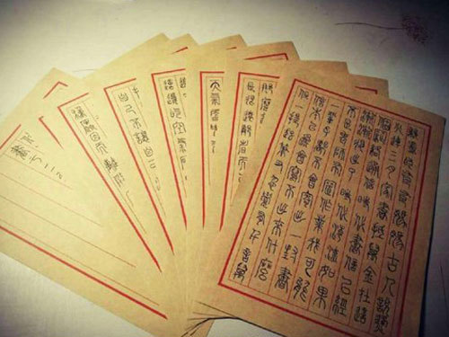
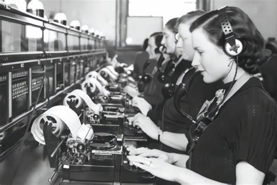
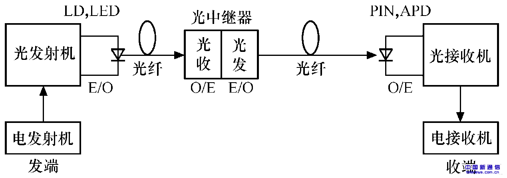
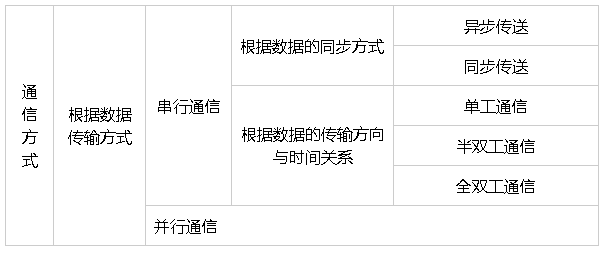
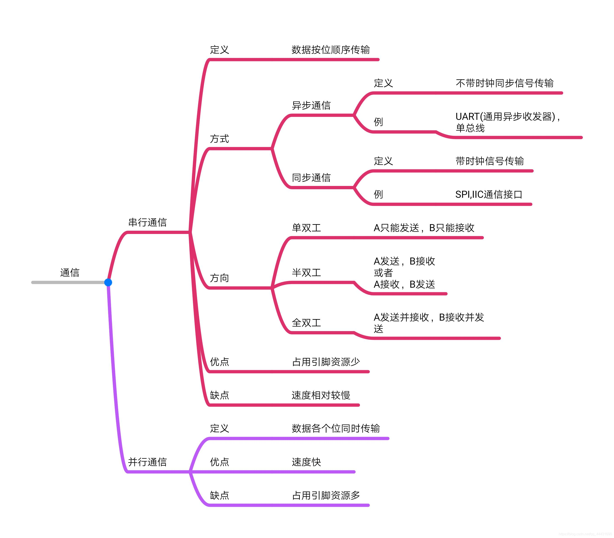
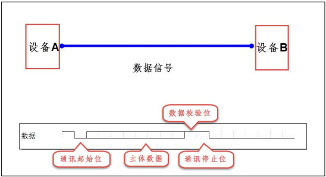
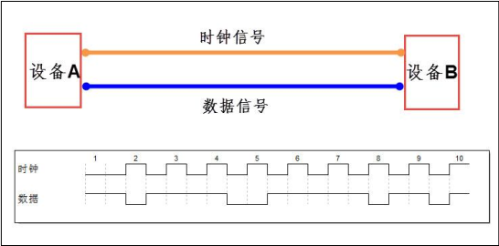
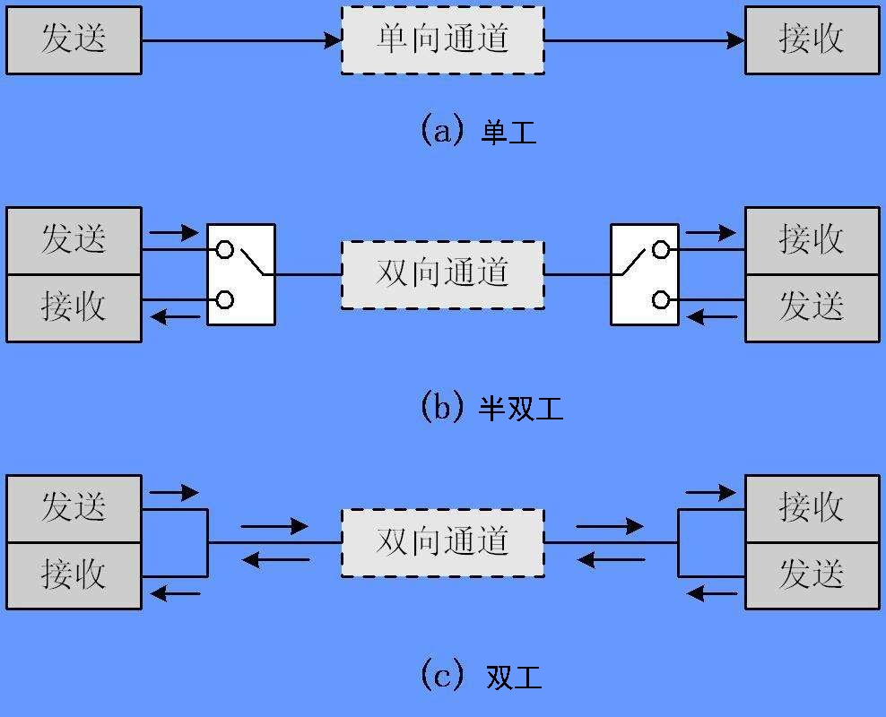

# 零、试讲内容

以串口为例，讲述通信和通信协议


# 一、开篇

在开始讲述串口通信之前，我们先来了解一下什么是通信和通信协议。

## 1、引入场景

请想象以下场景：

1. 唐朝的一个小兵远离家乡，在外打仗，如何向家人汇报平安？
    - **烽火连三月，家书抵万金**，那就是写**家书**

    

2. 二战的时候，前线如何快速地向后方汇报当前的战事情况？
    - 那时已经有了**电报**，要想尽快汇报前线战事，发电报是最好的选择

    

3. 现代战争，指挥部如何向前线下达命令？
    - 如果前线**网络**通畅，视频会议可能是最方便的方式
    
    

## 2、什么是通信？

以上三个场景，有着相同的需求，即：

**一方需要向另一方传递信息**

而所谓**通信**，简单来说就是信息的传递，都是把信息从一个地方传递到另一个地方。

在这里，我们先不谈论通信的距离，这只是衡量通信质量的一个因素而已。

信息传递的载体有很多：文字、语音、视频、电信号、光信号等等都可以传递信息

- 书信以文字的方式将信息从写信人传递到收信人


- 语音以声音的方式将信息由说话的人传递给收听的人


- 视频以丰富的画面将信息传递给观看视频的人


记住，通信说白了就是以某种方式，哪怕是一个手势、一个眼神，把信息从一方传递到另一方，哪怕信息传递有误，接收方误解了发送方的意思，这都是通信

当然，如果某种通信方式频繁发生信息传递错误，这说明这是一种不可靠的通信方式，那么应当避免采用这种通信方式，毕竟保障信息可靠、正确的传输是最重要的

后面会提到如何保障信息可靠、正确的传输

## 3、什么是通信协议？

先说一下协议是什么。

协议：是经过谈判、协商而制定的共同承认、共同遵守的文件。

通信协议：可以想象成是一种双方协商的“规则”，它告诉发送方应该如何打包、发送信息，以及接收方应该如何接收、解析这些信息

简单来说，协议就是一种“规则”，通信协议就是通信的规则

与游戏规则、交通规则、法律法规一样，它规定了我们应该遵顼什么，不能违背什么：

- 遵守“游戏规则”能让所有玩家有一个良好的游戏体验，打破“游戏规则”可能会受到游戏系统的处罚

- 遵守“交通规则”能保障道路有序、行人安全，违背“交通规则”的后果就是“**亲人两行泪**”


- 遵纪守法和违法乱纪分别是什么结果就不需要我多说了

- 遵守“通信规则”能保证信息被正确的发送和接收，违反“通信规则”大概率导致信息无法被正确的解析，通常是解析都解析不出来




# 二、有线通信和无线通信

下面简单讲述一下什么有线通信和无线通信

有线通信：狭义上指的是有线电信，即利用金属导线、光纤等有形媒质传送信息的方式。光或电信号可以代表声音、文字、图像等。

简单说，有线通信的信道是一条看得见摸得着的通信线。

无线通信：是利用电磁波信号在自由空间中传播的特性进行信息交换的一种通信方式。

简单说，无线通信用的是无线电传输，我们无法用肉眼看到无线通信的信道


# 三、串行通信和并行通信

通信分类：





## 1、串行通信

定义：串行通信是指数据按位依次传输的通信方式，每位数据占据固定的时间长度。在串行通信中，数据是在单条一位宽的传输线上一位接一位地顺序传送。

特点：
- 传输线少：串行通信只需要少数几条线就可以在系统间交换信息，布线简便易行，施工方便。
- 成本低：由于传输线少，所以成本相对较低。
- 抗干扰能力强：由于只使用一条线进行传输，抗干扰能力相对较强。
- 传输速度相对较慢：由于数据是按位依次传输，所以传输速度相对较低。

应用场景：串行通信特别适用于计算机与计算机、计算机与外设之间的远距离通信，以及对抗干扰要求较高的场景。

例子：
- USB（通用串行总线）是一种串行通信接口，通过一条数据线实现设备与计算机之间的数据通信。

## 2、并行通信

定义：并行通信是指多比特数据同时通过并行线进行传送，这样数据传送速度大大提高。

特点：
- 传输速度快：由于多个位的数据同时传输，所以传输速度较快。
- 抗干扰能力较弱：由于使用多条线进行传输，信号之间可能会相互干扰，抗干扰能力较弱。
- 传输线多：并行通信需要多条并行的传输线，占用较多的物理空间。
- 成本较高：由于传输线多，所以成本相对较高。

应用场景：并行通信主要应用于高速数据传输和对实时性要求较高的场景，如内存总线、处理器与外设之间的数据传输等。

例子：
- 内存总线是一种并行通信接口，计算机内部的数据传输多采用并行方式，以实现高速数据读写。

## 3、总结

串行通信和并行通信各有其特点和应用场景。

串行通信具有传输线少、成本低、抗干扰能力强等特点，适用于远距离传输和对抗干扰要求较高的场景。

而并行通信则具有传输速度快、实时性高等特点，适用于高速数据传输和对实时性要求较高的场景。

在实际应用中，需要根据具体需求选择合适的通信方式。


# 四、同步通信和异步通信

根据通讯的数据同步方式，又分为同步和异步两种。可以根据通讯过程中是否有使用到时钟信号进行简单的区分。

## 1、异步通信

在异步通讯中，不使用时钟信号进行数据同步，它们直接在数据信号中穿插一些同步用的信号位，或者把主体数据进行打包，以数据帧的格式传输数据。

例如规定由起始位、数据位、奇偶校验位、停止位等。

某些通讯中还需要双方约定数据的传输速率，以便更好地同步。波特率(bps)是衡量数据传送速率的指标。

特点：
- 灵活性高，成本低，使用简单。
- 传输效率较低，需要额外的同步机制（如起始位和停止位）。
- 适用于低速、近距离、非实时或半实时的数据传输。

例子：UART（通用异步收发传输器）是一种异步通信接口，常用于计算机与外部设备之间的通信，如串口通信。



## 2、同步通信

在同步通讯中，收发设备双方会使用一根信号线表示时钟信号，在时钟信号的驱动下双方进行协调，同步数据。

通讯中通常双方会统一规定在时钟信号的上升沿或下降沿对数据线进行采样。

在同步通讯中，数据信号所传输的内容绝大部分就是有效数据，而异步通讯中会包含有帧的各种标识符，所以同步通讯的效率更高，但是同步通讯双方的时钟允许误差较小，而异步通讯双方的时钟允许误差较大。

特点：
- 可以实现高速度、大容量的数据传送。
- 发送和接收双方要保持完全的同步，因此要求接收和发送设备必须使用同一时钟。
- 硬件和软件成本较高，适用于高速数据传输场景。

例子：SPI（串行外设接口）是一种同步通信协议，广泛应用于微控制器和外设之间的通信。




# 五、单工、半双工和全双工

串行通信又称为点对点通信，对于点对点之间的通信，根据数据的传输方向与时间关系，又可分为单工通信、半双工通信及全双工通信三种方式。



## 1、单工方式

只允许数据按照一个固定的方向传送，在任何时刻都只能进行一个方向的通信，一个设备固定为发送设备，一个设备固定为接收设备。

## 2、半双工方式

两个设备之间可以收发数据，但是不能在同一时刻进行，每次只能有一个设备发送，另一个站接收。

## 3、全双工方式

在同一时刻，两个设备之间可以同时进行发送和接收数据。

# 五、串口介绍

## 1、串口介绍

定义：UART（Universal Asynchronous Receiver/Transmitter），即通用异步收发传输器，是一种异步收发传输器，它将要传输的资料在串行通信与并行通信之间加以转换，主要用于数据的串行传输。

**特点**：
- 异步通信：UART通信是一种异步通信方式，发送和接收数据的时钟不同步。发送端和接收端通过协商好的波特率来进行通信，而不需要共享时钟信号。

- 简单灵活：UART通信协议相对简单，只需要发送和接收两个引脚，不需要额外的控制线或协议握手。这使得它在资源受限的嵌入式系统中非常适用。

- 适用于短距离通信：UART通信通常用于短距离通信，如电脑与串口设备之间的通信、微控制器与传感器之间的通信等。其传输距离受到串口芯片的限制，通常在几米到十几米左右。

- 数据可靠性：UART通信使用起止位标记数据的开始和结束，有助于接收端正确识别数据的边界。此外，UART通信还可以使用奇偶校验位来检测传输过程中的错误。

- 速度可调：UART通信的波特率可以调整，常见的波特率有9600、115200等。较高的波特率可以实现更快的数据传输速度，但同时也会增加传输错误的风险。

**UART的工作原理**：
- UART的工作原理主要包括数据的串行传输和并行转换。

- 首先，数据以并行方式输入到UART的发送缓冲区中。

- 然后，UART会将并行数据转换为串行数据，并根据事先确定的通信协议将数据逐位地发送出去。在发送数据的同时，UART还会生成一个时钟信号，用于控制数据的传输速度。接收端的UART会根据发送端的时钟信号来接收数据，并将串行数据转换为并行数据。

- 最后，接收端的数据会被存储在接收缓冲区中，供后续处理使用。

**UART的应用场景**：
- 嵌入式系统：UART在嵌入式系统中常用于与外部设备进行通信，如传感器、执行器、显示器等设备之间的数据传输。

- 智能家居：在智能家居系统中，UART可以实现智能设备之间的通信，如智能音箱与智能电视、智能灯具等设备之间的数据传输。

- 工业自动化：在工业自动化系统中，UART常用于各种工业设备之间的通信，如PLC（可编程逻辑控制器）与传感器、执行器等设备之间的数据传输。

- 车载电子：在车载电子系统中，UART可以实现车载设备之间的通信，如车载导航系统与车载音响、车载显示器等设备之间的数据传输。

- 物联网：在物联网中，UART常用于物联网设备之间的通信，如物联网终端与传感器、执行器、云平台等设备之间的数据传输。

## 2、串口通信参数

UART（通用异步收发传输器）通信参数在串口通信中起着至关重要的作用，它们定义了数据如何在发送器和接收器之间传输。以下是UART通信的主要参数：

1. 波特率（Baud Rate）：
    - 定义：波特率表示每秒传输的码元数（即二进制位），是衡量串口通信速度的重要指标。
    
    - 常见值：常用的波特率有1200、2400、4800、9600、19200、115200、230400、460800、921600等。

    - 重要性：波特率的选择取决于通信设备的要求和数据传输的速率。一个高速率的波特率可以提高数据传输的速度，但需要更高的处理能力。

2. 数据位（Data Bits）：
    - 定义：数据位指定了每个字符需要发送的位数。
    
    - 常见值：通常是8位或9位，取决于所使用的芯片或设备。

    - 重要性：数据位的设置根据获取和传输数据的要求来确定，8位数据位是最常见的配置。

3. 停止位（Stop Bits）：

    - 定义：停止位表示数据传输的结束，用于同步。
    
    - 常见值：常见的停止位数量可以是1位、1.5位或2位。

    - 重要性：停止位的设置取决于通信双方的约定，以确保数据传输的正确性。

4. 校验位（Parity Bits）：
    - 定义：校验位用于验证数据是否正确。

    - 类型：校验位有奇校验（odd）、偶校验（even）、0校验（space）、1校验（mark）以及无校验（noparity）等方式。

    - 重要性：虽然UART通信并不总是使用校验位，但在对数据可靠性要求较高的场景中，可以启用校验位以提高数据传输的可靠性。

5. 起始位（Start Bits）：
    - 定义：起始位用于表示数据的开始传输，由一个逻辑0的数据位表示。

    - 重要性：起始位是UART通信中非常重要的组成部分，它帮助接收方识别新的数据帧的开始。

6. 其他参数：

    - 超时时间：在某些情况下，通信双方可能会在一定时间内无法正常传输数据。为了解决这个问题，可以设置超时时间，当超过该时间后，通信双方会自动重试连接。

    - 硬件流控制：硬件流控制是一种避免数据传输中断的技术。当发送方发送数据时，如果接收方没有准备好接收数据，硬件流控制机制会自动暂停数据的发送，等待接收方准备好后再继续发送。

这些参数的正确配置对于保证UART通信的稳定性和可靠性至关重要。在设置这些参数时，需要考虑具体的硬件设备和应用场景，以确保通信的稳定性和可靠性。


# 六、STM32串口实验

STM32配置串口的步骤：

1. 初始化GPIO引脚，需要初始化与USART关联的GPIO引脚，配置为复用功能模式。
2. 配置USART参数，如波特率、数据位、停止位、校验位等。
3. 使用HAL库函数初始化USART。
4. 编写发送和接收数据的函数。
5. 调试和测试，确认USART是否正常工作。

## 1. 初始化GPIO引脚

注意：这里PA10配置为了中断模式，用于接收中断处理（可选）。

```C
void MX_GPIO_Init(void)  
{  
    GPIO_InitTypeDef GPIO_InitStruct = {0};  
  
    /* GPIO Ports Clock Enable */  
    __HAL_RCC_GPIOA_CLK_ENABLE();  
  
    /*Configure GPIO pin Output Level */  
    HAL_GPIO_WritePin(GPIOA, GPIO_PIN_9, GPIO_PIN_RESET);  
  
    /*Configure GPIO pin : PA9 */  
    GPIO_InitStruct.Pin = GPIO_PIN_9;  
    GPIO_InitStruct.Mode = GPIO_MODE_AF_PP;  
    GPIO_InitStruct.Pull = GPIO_NOPULL;  
    GPIO_InitStruct.Speed = GPIO_SPEED_FREQ_LOW;  
    GPIO_InitStruct.Alternate = GPIO_AF7_USART1;  
    HAL_GPIO_Init(GPIOA, &GPIO_InitStruct);  
  
    /*Configure GPIO pin : PA10 */  
    GPIO_InitStruct.Pin = GPIO_PIN_10;  
    GPIO_InitStruct.Mode = GPIO_MODE_IT_RISING;  
    GPIO_InitStruct.Pull = GPIO_NOPULL;  
    HAL_GPIO_Init(GPIOA, &GPIO_InitStruct);  
  
    /* EXTI interrupt init */  
    HAL_NVIC_SetPriority(EXTI15_10_IRQn, 0, 0);  
    HAL_NVIC_EnableIRQ(EXTI15_10_IRQn);  
}
```

## 2. 配置USART参数并初始化

```C
void MX_USART1_UART_Init(void)  
{  
    huart1.Instance = USART1;  
    huart1.Init.BaudRate = 115200;  
    huart1.Init.WordLength = UART_WORDLENGTH_8B;  
    huart1.Init.StopBits = UART_STOPBITS_1;  
    huart1.Init.Parity = UART_PARITY_NONE;  
    huart1.Init.Mode = UART_MODE_TX_RX;  
    huart1.Init.HwFlowCtl = UART_HWCONTROL_NONE;  
    huart1.Init.OverSampling = UART_OVERSAMPLING_16;  
    if (HAL_UART_Init(&huart1) != HAL_OK)  
    {  
        Error_Handler();  
    }  
}
```

## 3. 数据发送

```C
void USART_SendString(UART_HandleTypeDef *huart, uint8_t *pData, uint16_t Size)  
{  
    HAL_UART_Transmit(huart, pData, Size, HAL_MAX_DELAY);  
}  
  
int main(void)  
{  
    // ... 初始化代码 ...  
  
    uint8_t message[] = "Hello, STM32!\r\n";  
    USART_SendString(&huart1, message, sizeof(message) - 1); // 发送字符串  
  
    // ... 其他代码 ...  
}

```

## 4. 数据接收（中断模式）

代码中关于中断处理的部分，我们需要检查USART的接收标志位，并读取接收到的数据。以下是完成USART接收功能的代码示例：

首先，确保在USART初始化后已经使能了接收中断：

```C
void MX_USART1_UART_Init(void)  
{  
    // ... 之前的初始化代码 ...  
  
    // 使能接收中断  
    HAL_UART_Receive_IT(&huart1, &rxData); // 假设rxData是一个全局变量，用于存储接收到的数据  
}

```

然后，在中断服务程序中处理接收到的数据：

```C

uint8_t rxData = 0; // 全局变量，用于存储接收到的数据  
  
void USART1_IRQHandler(void)  
{  
    HAL_UART_IRQHandler(&huart1);  
}  
  
void HAL_UART_RxCpltCallback(UART_HandleTypeDef *huart)  
{  
    if(huart->Instance == USART1)  
    {  
        // 在这里处理接收到的数据 rxData  
        // 例如，可以将其放入一个缓冲区，或者执行其他操作  
        // ...  
  
        // 准备下一次接收  
        HAL_UART_Receive_IT(&huart1, &rxData);  
    }  
}  
  
void HAL_UART_ErrorCallback(UART_HandleTypeDef *huart)  
{  
    // 错误处理  
    // ...  
}

```

注意：在上面的代码中，USART1_IRQHandler 是USART1的中断服务程序，它调用了 HAL_UART_IRQHandler 来检查和处理USART的中断事件。当接收到数据时，HAL_UART_RxCpltCallback 回调函数会被调用，此时可以处理接收到的数据 rxData。

## 5. 调试和测试

使用串口调试助手或其他串行通信工具连接到STM32的USART端口，发送和接收数据以验证USART是否正常工作。

## 6. 注意事项

- 确保在调用 HAL_UART_Init 之前已经初始化了GPIO和相关的时钟。

- 如果使用中断模式接收数据，请确保在USART初始化后使能了接收中断，并在中断服务程序中正确地处理接收到的数据。

- 在实际应用中，可能需要考虑数据的缓冲和同步问题，以避免数据丢失或混乱。
